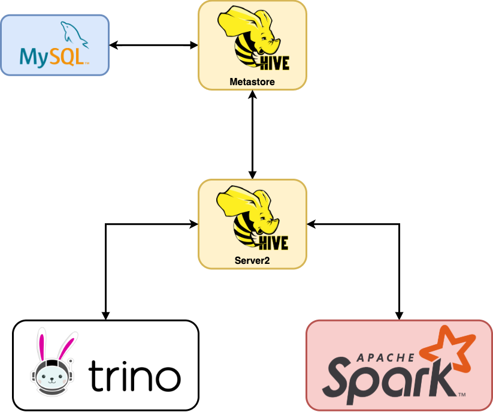

# analytics-platform-diy


## Installation

### Build and push Docker images
```
cd docker-hadoop
docker build -t hadoop-base:3.2.2 -f  .
cd ../docker-hive-metastore
docker build -t localhost:5000/hive-metastore:3.2.2 .
cd ../docker-hive-server2
docker build -t localhost:5000/hive-server2:3.2.2 .
cd ..

docker push localhost:5000/hive-metastore:3.2.2
docker push localhost:5000/hive-server2:3.2.2
```
### Install Metastore
First, install a MySQL Database to persist the data, next deploy HiveMetastore to actually use and prepare this data, 
and finally Hive Server2 to interface with other components. 
The architecture of Hive deployment is illustrated below.

#### Install MySQL
```
helm repo add bitnami https://charts.bitnami.com/bitnami
helm install mysql bitnami/mysql
```
Export Secret
```
kubectl create secret generic mysql-secret --from-literal=ROOT_PASSWORD=$(kubectl get secret --namespace default mysql -o jsonpath="{.data.mysql-root-password}" | base64 --decode)
```

#### Install Hive Metastore
```
helm install hive-metastore ./2.hive-metastore 
```

#### Install Hive Server2
```
helm install hive-server2 ./3.hive-server2 
```

### Install Trino
```
helm install trino ./4.trino
```

### Install Jupyterhub
https://zero-to-jupyterhub.readthedocs.io/en/0.11.1/jupyterhub/installation.html
```
helm repo add jupyterhub https://jupyterhub.github.io/helm-chart/
helm repo update

RELEASE=jhub
NAMESPACE=default

helm upgrade --cleanup-on-fail \
  --install $RELEASE jupyterhub/jupyterhub \
  --namespace $NAMESPACE \
  --create-namespace \
  --version=0.11.1 \
  --values 5.jupyterhub/config.yaml
```

### Access
To reach Trino UI and JupyterHub, first we need to modify `/etc/hosts`
```
echo "$(minikube ip) trino.myplatform.ai myplatform.ai" | sudo tee -a /etc/hosts 
```

Trino UI will be available at `trino.myplatform.ai` and JupyterHub will be available at `myplatform.ai/jupyterhub`.
The inconsistency in the endpoints is forced by the way how ingress-controller works in minikube.
